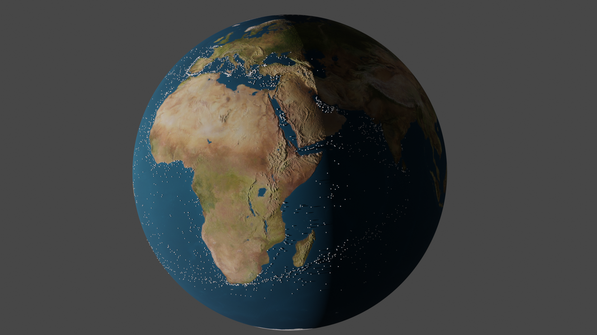
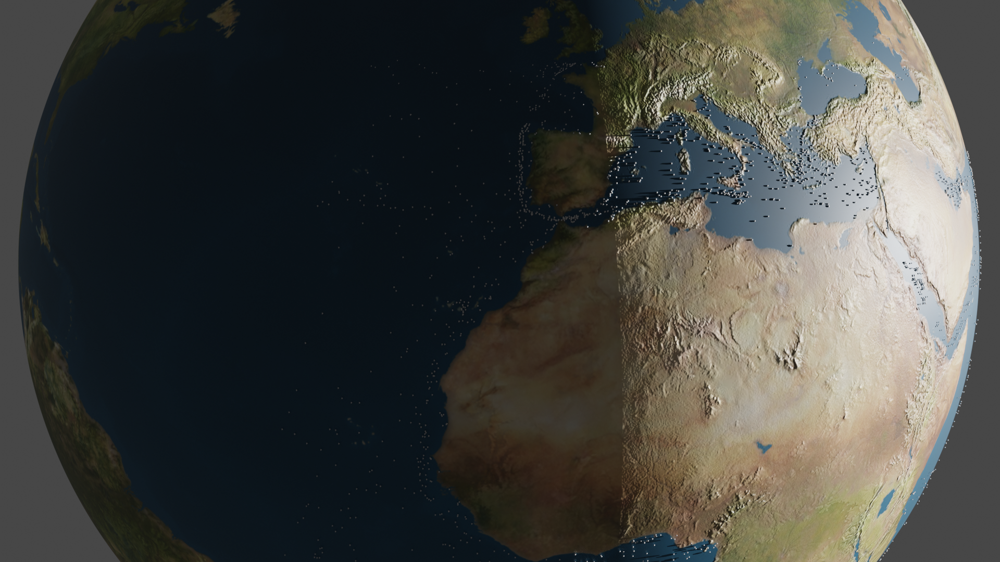
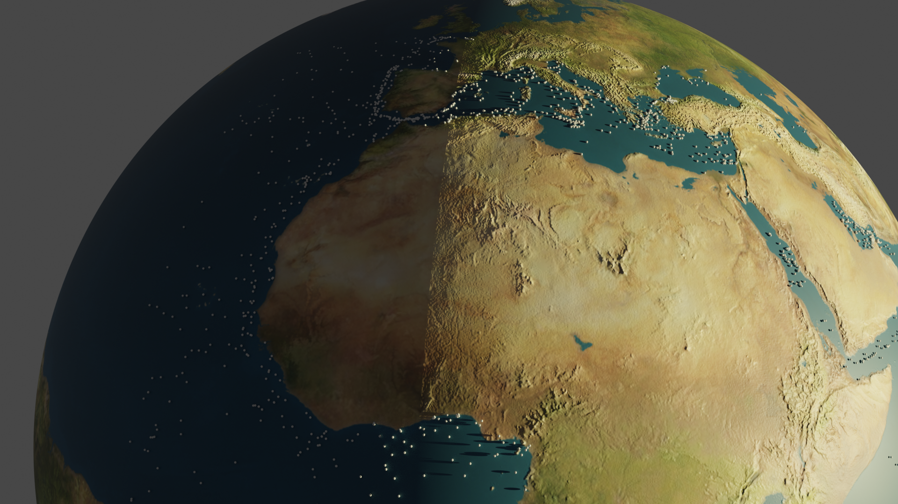
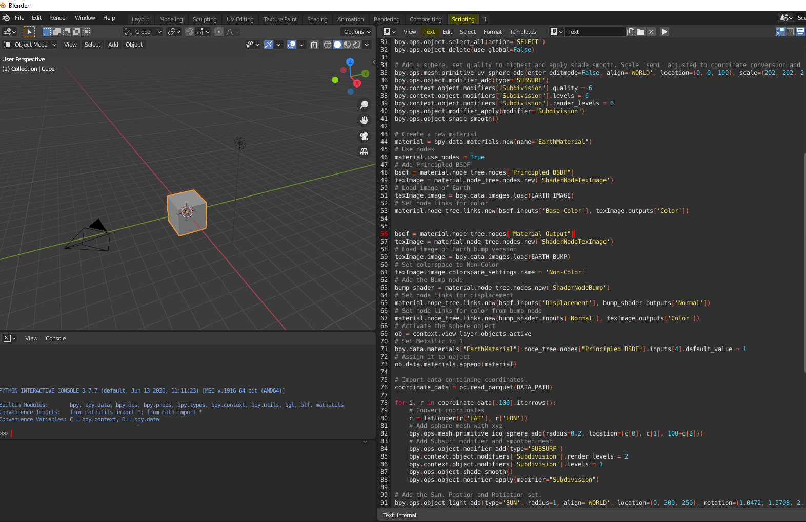

## Blender 3d Earth with positional data.

This code snippet makes a 3d sphere of Earth and plots positional data on top, using python and the insane free/open source 3D creation suite [Blender 3d](https://www.blender.org/)

### Requirements

Blender 3d (Python inculded in software)

Earth Images from [PlanetPixel](http://planetpixelemporium.com/earth8081.html) 

(8081_earthmap4k.jpg, 8081_earthbump4k.jpg where used in this example)

Positional data of some sort (latitude and longitude in decimal format)

### Guide

1 - Open a new project in Blender 3D.

2 - From the panels above select 'Scripting'

3 - Select 'Text'/New
	
4 - Paste the code from 3d-earth-and-coordinates.py insde the text editor.

Example of what you should see.

5 - Replace the paths in these 3 variables. 

	EARTH_IMAGE = "D:\\EARTH_MAPS\\8081_earthmap4k.jpg" # Substitute with your local path
	EARTH_BUMP = "D:\\EARTH_MAPS\\8081_earthbump4k.jpg" # Substitute with your local path
	DATA_PATH = r'YOUR_PATH_TO\coordiante_data.gzip'    # Substitute with your local path
	
6 - Press 'Alt' + p to execute the code

After result is set you can go back to the 'Modeling' Panel, select the Camera View and play around before rendering.

### Additional

Cycles render engine was used for the images in this repo
Positional vessel data from [MarineTraffic](https://www.marinetraffic.com/)

